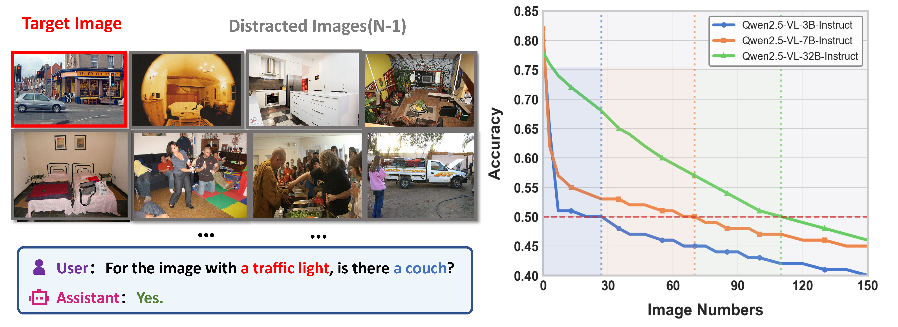

# Towards Long-window Anchoring in Vision-Language Model Distillation

## Introduction

  While large vision-language models (VLMs) demonstrate impressive long-context understanding, their prevalent small branches fail on linguistics-photography alignment for a limited window size. We discover that knowledge distillation improves students' capability as a complement to Rotary Position Embeddings (RoPE) on certain window sizes (anchored from large models). Building on this insight, we propose \mn, which explicitly targets the transfer of long-range attention mechanisms through two complementary components: (1) a progressive distance-weighted attention matching that dynamically emphasizes longer position differences during training, and (2) a learnable RoPE response gain modulation that selectively amplifies position sensitivity where needed. Extensive experiments across multiple model families demonstrate that \mn-distilled models achieve up to 3.2× longer effective context windows compared to baseline small models, while maintaining or improving performance on standard VL benchmarks. Spectral analysis also suggests that \mn~successfully preserves crucial low-frequency attention components that conventional methods fail to transfer. Our work not only provides practical techniques for building more efficient long-context VLMs but also offers theoretical insights into how positional understanding emerges and transfers during distillation.



## Installation Guide

<!-- ### Environment

```bash
conda create -n LAid python=3.10
pip install -r requirements.txt
``` -->

### Quick Start

In our experiments, we use Qwen2.5-VL-32B as Teacher Model, and Qwen2.5-VL-7B as Student Model. We train our models on [Visual haystacks Dataset](https://github.com/visual-haystacks/vhs_benchmark). 

You can start your training by:
```bash
python KD/RoPE_KD.py
```

### Evaluation


We evaluate our models on [Visual haystacks Dataset](https://github.com/visual-haystacks/vhs_benchmark) and some ICL datasets.

For the code for evaluation on Visual haystacks Dataset, please refer to [Visual haystacks Dataset](https://github.com/visual-haystacks/vhs_benchmark).


Related codes will be released soon.

